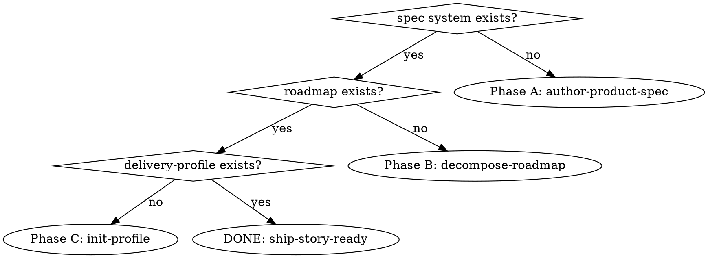

# Kickoff

## Overview

Single entry that bootstraps a project until it's **ship-story-ready** — it has `global_specs` + a roadmap + `.claude/delivery-profile.md`. Orchestrates the three inception phases: A `elephant:author-product-spec` → B `elephant:decompose-roadmap` → C `elephant:init-profile`.

**Core principle: kickoff is a THIN orchestrator — it produces nothing itself.** It detects which phase the project is at, dispatches the right sub-skill, carries each phase's output path to the next, and stops at phase boundaries. It does NOT reimplement any phase.

**REQUIRED SUB-SKILLS** (dispatch via the Skill tool, don't reinvent): `elephant:author-product-spec` (A), `elephant:decompose-roadmap` (B), `elephant:init-profile` (C).

## Step 0 — Detect phase, resume the first that's missing

Evaluate top-to-bottom; resume at the FIRST missing artifact; short-circuit. The digraph below is **present/absent only** — completeness/approval is judged separately (see the note under the table), because approval is a conversation event, not a file marker.

Look under Elephant's standard layout `docs/elephant/<product>/` first; fall back to a wider `docs/**` scan for projects that predate the convention (a non-`docs/` location → ask rather than assume absence).

| Check | Mechanical detection |
|---|---|
| spec system | a `master-spec*` file AND an `object-model*` file-or-dir (e.g. `10-object-model/`) — Elephant default `docs/elephant/<product>/spec/` |
| roadmap | a `*roadmap*` file with a phase-overview heading + slice tables — Elephant default `docs/elephant/<product>/roadmap.md` (NOT a master-spec's "object-model overview" section) |
| delivery-profile | `.claude/delivery-profile.md` exists |
| all three | announce **ship-story-ready** and stop |

**Detection is binary only for "absent vs present"; completeness is the sub-skill's job.** A present-but-incomplete artifact (e.g. a master-spec with no AD/ED yet, or a roadmap written but not yet user-approved) counts as **the current phase, not a finished one**: dispatch that phase's sub-skill and let its own completeness/resume logic continue it. Do NOT advance past an incomplete artifact. When unsure whether an artifact is complete, dispatch its phase and let the sub-skill decide — never skip a phase on a fuzzy "looks present." **Because approval/completeness isn't on disk, when an artifact is present ask the user "is this complete & approved, or should I resume it?" before advancing** — don't infer "done" from file existence alone.

## Orchestration

1. **Dispatch** the current phase's sub-skill. Each sub-skill owns its internal checkpoints (incl. its final review) — kickoff does NOT add or duplicate them.
2. **🛑 Boundary = the sub-skill's own final checkpoint. Do NOT fire a second stop.** When the user approves a phase's final review (author-product-spec CHECKPOINT 3 / decompose-roadmap CHECKPOINT 2 / init-profile's confirm), in that same beat ask whether to proceed to the next phase. One stop per seam, not two. **Resume:** the user proceeds by saying go-ahead, or by re-invoking `/kickoff` (Step 0 re-detects and continues). Never auto-flow into the next phase without that go-ahead.
3. **Carry paths forward (in-session chain):**
   - Pass Phase A's resolved spec-dir to Phase B → B's locate uses its "Phase A in-session output" branch directly (no repo scan / no asking).
   - Phase C (`init-profile`) **derives** `roadmap_path` by scanning, not from a passed value — so surface Phase B's roadmap path to C as a **confirm-time hint** (especially if B wrote outside `docs/**`, where C's scan would miss it). Don't claim C consumes it directly.
   - Across sessions (not chained), Step 0's detection re-locates the artifacts.

## Completion

When all three artifacts exist, announce the project is **ship-story-ready**: deliver stories with `ship-story <ID>`.

## Red flags — STOP

- Writing spec docs / a roadmap / a profile yourself → dispatch the sub-skill; kickoff produces nothing.
- Skipping a boundary stop and auto-flowing A→B→C → each transition needs the user's go-ahead.
- Adding extra checkpoints inside a phase → the sub-skill owns those.
- Re-running a phase whose artifact is already COMPLETE → Step 0 detects it; skip to the next. (Incomplete artifact = resume that phase via its sub-skill, don't restart from scratch.)
- Advancing past a present-but-incomplete artifact because it "looks present" → dispatch its phase; the sub-skill judges completeness.

## Common mistakes

- **Starting at Phase A on a project that already has specs.** Always run Step 0 detection first; a half-kicked-off project resumes mid-pipeline.
- **Not handing the path forward.** In a chained run, pass A's spec-dir to B directly; surface B's roadmap path to C as a confirm-time hint (C still derives by scanning).
