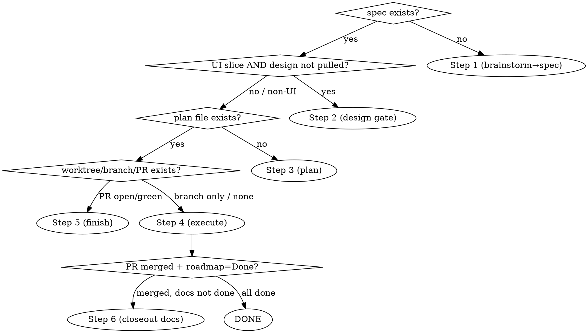

# Ship-Story

## Overview

Deliver ONE roadmap story end-to-end by orchestrating superpowers skills, with every project-specific gate, path, and convention injected from the repo's **delivery-profile** (`.claude/delivery-profile.md`).

**Core principle: ship-story is a THIN orchestrator. It does NOT reimplement brainstorm / plan / execute — it dispatches the superpowers skills that do, and inserts the project's own gates between them.** It adds exactly three things vanilla superpowers lacks: (1) project-profile injection, (2) a research-augmented brainstorm front-end, (3) phase-aware cross-session resume.

## Prerequisites

- A `.claude/delivery-profile.md` exists in the repo. It is the contract that supplies all project-specifics (paths, gates, finish style, conventions). Schema + how to author one: see `delivery-profile-schema.md` in this skill dir.
- **If no profile exists:** STOP. Tell the user this repo isn't kicked off yet — either run `kickoff` (when it exists) or hand-author `.claude/delivery-profile.md` from the schema. Do NOT guess project conventions.

## Step 0 — Load, locate, detect phase

1. Read `.claude/delivery-profile.md`.
2. Locate `<ID>` in the profile's `roadmap_path`; read that story's scope.
3. **Detect the current phase from artifacts.** Evaluate the checks **top-to-bottom in this order; resume at the FIRST row whose artifact is absent/incomplete, and stop checking (short-circuit).** The `[slug]` is unknown at detect time, so glob on the ID. Then announce "Story `<ID>` is at phase X — resuming there." Never redo a completed phase.

| Row → resume at | Mechanical check |
|---|---|
| spec missing → Step 1 | glob `<spec_dir>/<ID>-*.md`; any match (status ≥ Draft) means present. Read its header for status. |
| design missing → Step 2 | **only if the slice is UI** — read the spec's §6 sensitivity (`ui_detection`); if Low / non-UI, this row does not apply, fall through to the plan check. If UI: present iff `design_local_dir` for `<ID>` exists and is non-empty. |
| plan missing → Step 3 | glob `<plan_dir>/<ID>-*.md`; any match counts (plans may be split, e.g. `<ID>-T8-*.md`) |
| no branch/PR → Step 4 | `git worktree list` and `git branch --list "*<ID>*"` per `branch_pattern`; `gh pr list --search "<ID>"` |
| PR open, not merged → Step 5 | `gh pr view --json state` ≠ MERGED |
| merged, roadmap ≠ Done → Step 6 | `gh pr view --json state` = MERGED but roadmap row lacks the Done marker (else: fully done) |

## Orchestration spine

| Phase | Superpowers skill dispatched | Profile-injected gate |
|---|---|---|
| 1 — research+brainstorm → spec | `superpowers:brainstorming` | research policy; field-naming prereq; spec_dir/template/status_flow. **🛑 STOP: user reviews spec** |
| 2 — design gate (UI only) | (DesignSync) | only if slice is UI (see detection below). **🛑 STOP: wait for user "ready" signal**, then auto-pull design |
| 3 — plan | `superpowers:writing-plans` | plan_dir; UI plan written against pulled design. *No stop — flows into execute* |
| 4 — execute | `superpowers:using-git-worktrees` + `superpowers:subagent-driven-development` | isolation; review cadence; profile `gotchas`; run `changeset_cmd` as part of the execute commits (before opening the PR), NOT in closeout |
| 5 — finish | `superpowers:finishing-a-development-branch` | PR → wait `ci_required_checks` green → **auto squash-merge on green**. If `gh pr merge` errors from the worktree, verify `gh pr view --json state` = MERGED before any retry (the merge likely already succeeded). Then clean worktree + sync main |
| 6 — closeout docs | (none) | single commit: roadmap → Done + refresh touched CLAUDE.md + check root snapshot. Object-model/field-contract docs are NOT touched here (Step 1 owns those). Use `empty_cmd` if this commit needs a changeset |

## Step 1 detail — research-augmented brainstorm

1. Load the profile's `global_specs` as context.
2. Internally draft the clarifying questions you would ask.
3. **Auto-assess**: does this story have mature industry precedent (competitor products, standard approaches)?
4. If yes → **announce, then confirm before spending tokens**: "Planning to fan out N agents to research X/Y/Z, carrying these questions — go?" On confirm, do a **light fan-out** (3-5 `Explore`/general agents, one vertical each) per the profile's research depth. Synthesize: self-answer what you can, sharpen the rest.
5. Run `superpowers:brainstorming` with the fewer, sharper remaining questions.
6. If the profile's field-naming prereq is enabled and this slice creates fields (determined from the slice scope during brainstorm — any new entity/table/column): read the `decision_ref` (e.g. AD-23) for the naming convention, agree the names with the user, and **edit the `field_contract_location` files** (flip TBD → real names) BEFORE writing the spec. This is the only object-model doc edit owned by Step 1 — closeout (Step 6) does NOT touch object-model docs.
7. Write the spec to `spec_dir` at status **`Draft`** (first status in `status_flow`). **🛑 STOP — user reviews the spec.** Resume signal = user approves the spec (re-invoking `/ship-story <ID>` also resumes). On approval, flip the spec to **`Refined`** and continue.

## Step 2 detail — design gate

- **UI detection (default):** the slice is UI iff its spec §6 Design Brief sensitivity ≠ Low. Pure backend/schema/auth slices skip this gate entirely. **Fail-safe:** if the spec has no §6 sensitivity field, do NOT default to non-UI — STOP and ask the user whether this slice needs the design gate.
- Spec is already at `Refined` (Step 1 flipped it on approval). Tell the user you're waiting for the **ready signal** (human-given — you do NOT generate the design). Resume signal = the user says design is ready (or re-invokes `/ship-story <ID>`).
- **If `design_project_ref` is `TBD`/empty:** STOP and ask the user for the Claude Design projectId (and write it back into the profile). Do NOT skip the gate and do NOT guess.
- On the ready signal, use **DesignSync** (`list_projects` → the profile's `design_project_ref` → `list_files`/`get_file`) and `slice_to_design_mapping` to pull the slice's design page **into the profile's `design_local_dir` for `<ID>`** (this is what Step 0 detects as "design pulled"). Don't ask the user to paste links/tars.

## Hard checkpoints (only these two stop)

| Stop | Fires when | Resume signal |
|---|---|---|
| 1 — spec review | spec written (Draft) | user approves → flip spec to Refined → continue |
| 2 — design gate (UI slices) | spec at Refined, slice is UI | user says design is ready → auto-pull design → continue |

Either stop also resumes by re-invoking `/ship-story <ID>` (Step 0 re-detects phase). Everything else flows automatically: plan → execute → PR → (CI green) → squash-merge → closeout docs.

## Red flags — STOP

- About to write brainstorm/plan/execute logic yourself → don't. Dispatch the superpowers skill.
- About to hardcode a path, check name, or convention → it belongs in the profile. Read it from there.
- No `.claude/delivery-profile.md` but proceeding anyway → stop; the repo isn't kicked off.
- About to merge while a `ci_required_checks` entry is not green → never. Green is the gate.
- Skipping the spec-review or design-gate stop "to save a round-trip" → those are the two hard gates. Don't.
- Redoing a phase whose artifact already exists → re-detect phase in Step 0 and resume, don't restart.

## Common mistakes

- **Guessing conventions instead of reading the profile.** The whole point is zero hardcoding.
- **Running research on a slice with no industry precedent** — internal/bespoke slices skip straight to brainstorm.
- **Treating DesignSync as a design generator** — it only reads/pulls (and can push a local component library); creative design generation is the human ready-signal step.
