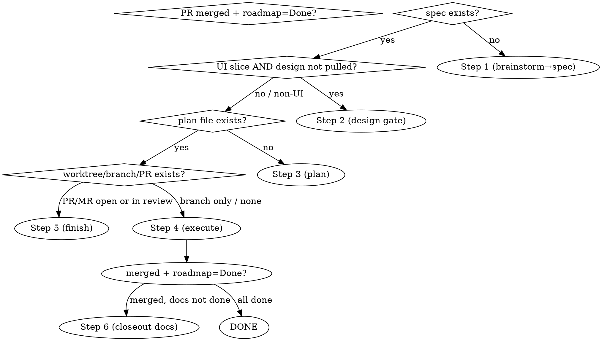

# Ship-Story

## Overview

Deliver ONE roadmap story end-to-end by orchestrating Superpowers skills, with every project-specific gate, path, and convention injected from the repo's **delivery-profile** (`.agents/elephant/delivery-profile.md`).

**Core principle: ship-story is a THIN orchestrator. It does NOT reimplement brainstorm / plan / execute — it dispatches the superpowers skills that do, and inserts the project's own gates between them.** It adds exactly three things vanilla superpowers lacks: (1) project-profile injection, (2) a research-augmented brainstorm front-end, (3) phase-aware cross-session resume.

## Prerequisites

- A `.agents/elephant/delivery-profile.md` exists in the repo. It is the contract that supplies all project-specifics (paths, gates, finish style, conventions). Schema + how to author one: see `delivery-profile-schema.md` in this skill dir.
- **If no profile exists:** STOP. Tell the user this repo isn't kicked off yet — either run `kickoff` or run `init-profile`. Do NOT guess project conventions.

## Preflight

Before producing artifacts:

1. Read `../../references/runtime-compatibility.md`.
2. Confirm the canonical Superpowers skills required by the current and later phases are installed: `superpowers:brainstorming`, `superpowers:writing-plans`, `superpowers:using-git-worktrees`, `superpowers:subagent-driven-development` or `superpowers:executing-plans`, and `superpowers:finishing-a-development-branch`.
3. Confirm `design.provider` is `manual` or `claude-design` when the design gate is enabled.
4. If a required capability is absent, STOP before writing artifacts and give host-appropriate setup guidance.

## Step 0 — Load, locate, detect phase

1. Read `.agents/elephant/delivery-profile.md`.
2. Locate `<ID>` in the profile's `roadmap_path`; read that story's scope.
3. **Detect the current phase from artifacts.** Evaluate the checks **top-to-bottom in this order; resume at the FIRST row whose artifact is absent/incomplete, and stop checking (short-circuit).** The `[slug]` is unknown at detect time, so glob on the ID. Then announce "Story `<ID>` is at phase X — resuming there." Never redo a completed phase.

| Row → resume at | Mechanical check |
|---|---|
| spec missing → Step 1 | glob `<spec_dir>/<ID>-*.md`; any match (status ≥ Draft) means present. Read its header for status. |
| design missing → Step 2 | **only if the slice is UI** — read the spec's §6 sensitivity (`ui_detection`); if Low / non-UI, this row does not apply, fall through to the plan check. If UI: present iff `design_local_dir` for `<ID>` exists and is non-empty. |
| plan missing → Step 3 | glob `<plan_dir>/<ID>-*.md`; any match counts (plans may be split, e.g. `<ID>-T8-*.md`) |
| no branch/PR → Step 4 | `git worktree list` and `git branch --list "*<ID>*"` per `branch_pattern`; for the GitHub-PR `integration`, also `gh pr list --search "<ID>"` |
| PR open, not merged → Step 5 | (GitHub-PR `integration`) `gh pr view --json state` ≠ MERGED. Non-GitHub integrations: use that integration's merged-check |
| merged, roadmap ≠ Done → Step 6 | merged per the `integration` but roadmap row lacks the Done marker (else: fully done) |

```dot
digraph phase_detect {
  "PR merged + roadmap=Done?" [shape=diamond];
  "worktree/branch/PR exists?" [shape=diamond];
  "plan file exists?" [shape=diamond];
  "UI slice AND design not pulled?" [shape=diamond];
  "spec exists?" [shape=diamond];

  "spec exists?" -> "Step 1 (brainstorm→spec)" [label="no"];
  "spec exists?" -> "UI slice AND design not pulled?" [label="yes"];
  "UI slice AND design not pulled?" -> "Step 2 (design gate)" [label="yes"];
  "UI slice AND design not pulled?" -> "plan file exists?" [label="no / non-UI"];
  "plan file exists?" -> "Step 3 (plan)" [label="no"];
  "plan file exists?" -> "worktree/branch/PR exists?" [label="yes"];
  "worktree/branch/PR exists?" -> "Step 5 (finish)" [label="PR/MR open or in review"];
  "worktree/branch/PR exists?" -> "Step 4 (execute)" [label="branch only / none"];
  "Step 4 (execute)" -> "merged + roadmap=Done?";
  "merged + roadmap=Done?" -> "Step 6 (closeout docs)" [label="merged, docs not done"];
  "merged + roadmap=Done?" -> "DONE" [label="all done"];
}
```

## Orchestration spine

| Phase | Superpowers skill dispatched | Profile-injected gate |
|---|---|---|
| 1 — research+brainstorm → spec | `superpowers:brainstorming` | research policy; field-naming prereq; spec_dir/template/status_flow. **The brainstorm IS the review — no stop.** Write the spec, auto-flip Draft→Refined, continue |
| 2 — design gate (UI only) | selected `design.provider` | only if slice is UI (see detection below). **First commit + push the spec to main**, then **🛑 STOP: wait for the human ready signal**. Obtain design artifacts through `manual` or `claude-design`, then validate the common handoff contract |
| 3 — plan | `superpowers:writing-plans` | plan_dir; UI plan written against the obtained design. *No stop — flows into execute (non-UI slices reach here straight from Step 1)* |
| 4 — execute | `superpowers:using-git-worktrees` + `superpowers:subagent-driven-development` | **flip spec to `Implementing` (§7 Cross-Module Contract now frozen — to change it, drop back to `Refined`)**; isolation; review cadence; profile `gotchas`; run `changeset_cmd` as part of the execute commits (before opening the PR), NOT in closeout |
| 5 — finish | `superpowers:finishing-a-development-branch` | follow the profile's `finish.integration` (default: GitHub PR + squash). For the PR default: open PR → wait `ci_required_checks` green → **auto squash-merge on green** (if `gh pr merge` errors from a worktree, verify `gh pr view --json state` = MERGED before retry); then clean worktree + sync main. A non-GitHub / trunk-based `integration` uses its own mechanics — don't assume `gh` |
| 6 — closeout docs | (none) | flip the slice's spec to `Done` (all AC ✅); single commit: roadmap → Done + refresh the profile's `instruction_refresh_targets` + check root snapshot. Object-model/field-contract docs are NOT touched here (Step 1 owns those). Use `empty_cmd` if this commit needs a changeset |

## Step 1 detail — research-augmented brainstorm

1. Load the profile's `global_specs` as context.
2. Internally draft the clarifying questions you would ask.
3. **Auto-assess**: does this story have mature industry precedent (competitor products, standard approaches)?
4. If yes → **announce, then confirm before spending tokens**: "Planning N bounded research scopes for X/Y/Z, carrying these questions — go?" On confirm, assign one independent scope to each worker when delegation is available. Without delegation, execute the same scopes sequentially in the current agent. Synthesize centrally: self-answer what you can, sharpen the rest.
5. Run `superpowers:brainstorming` with the fewer, sharper remaining questions.
6. If the profile's field-naming prereq is enabled and this slice creates fields (determined from the slice scope during brainstorm — any new entity/table/column): read the `decision_ref` (the project's naming-convention decision-record id, e.g. `AD-3`) for the convention, agree the names with the user, and **edit the `field_contract_location` files** (flip TBD → real names) BEFORE writing the spec. This is the only object-model doc edit owned by Step 1 — closeout (Step 6) does NOT touch object-model docs.
7. Write the spec to `spec_dir` **using the profile's `spec_template`** (default: `slice-template.md` in this skill dir), filename per the profile's `filename_rule` (default `[ID]-[slug].md` — Step 0 detection assumes the `<ID>` lead), at status **`Draft`** (first status in `status_flow`). The template is a **dual-input contract** for Code and Design — fill §6 Design Brief (incl. **Sensitivity**, which drives the design gate) and §7 Cross-Module Contract even for backend-leaning slices, so the spec stays consumable by both sides. **No spec-review stop** — the research-augmented brainstorm already involved the user heavily, so it *is* the spec review; reliability downstream is assured. Write the spec, immediately flip it to **`Refined`**, and continue. What happens next is decided entirely by the design gate (Step 2): if the slice trips the gate, the gate's commit-push-main + wait-for-design is the only stop; if it doesn't, flow straight through plan → execute with **no stops at all**.

## Step 2 detail — design gate

- **Gate disabled?** If the profile's `design gate.enabled` is false (e.g. a CLI / library / data-pipeline / headless project), skip Step 2 entirely for every slice — no §6 check, no waiting.
- **UI detection (default, when gate enabled):** the slice is UI iff its spec §6 Design Brief sensitivity ≠ Low. Pure backend/schema/auth slices skip this gate. **Fail-safe:** if a gate-enabled project's spec has no §6 sensitivity field, do NOT default to non-UI — STOP and ask the user whether this slice needs the design gate.
- **On entering the gate, commit + push the spec to main first.** The user is about to walk away to produce the design; pushing the `Refined` spec to remote main makes it durable and shareable (design tooling / collaborators can read it) for the whole wait. Do this BEFORE you stop.
- Spec is already at `Refined` (Step 1 flipped it on writing — the brainstorm was the review). Tell the user the exact `design_local_dir`, configured `handoff_file` (default `design-handoff.md`), and ready-signal requirement. Resume when the user gives the signal or re-invokes `ship-story` for the same ID.
- **`provider: manual`** — the user places design artifacts and `design-handoff.md` under the slice's `design_local_dir`. Do not infer approval from file presence.
- **`provider: claude-design`** — after the human signal, use DesignSync to resolve `claude_design.project_ref`, apply `claude_design.slice_to_design_mapping`, and pull artifacts into `design_local_dir`. If either applicable field is `TBD`/empty, STOP and ask for that exact value. Generate or validate the same `design-handoff.md`.
- **Common gate:** continue only when the directory is non-empty, the handoff file exists, and the human signal is recorded. The handoff covers key screens/states, interactions and transitions, the mapping to spec §7, and unresolved implementation constraints.
- Any provider other than `manual` or `claude-design` is unsupported: STOP and list the two supported values.

## Hard checkpoint (only the design gate stops)

| Stop | Fires when | Resume signal |
|---|---|---|
| design gate (UI slices only) | spec written & at Refined, slice is UI → commit + push spec to main, then wait | human signal + artifacts + `design-handoff.md` → continue |

**Non-UI slices have NO stop.** They run brainstorm → spec → plan → worktree execute → PR → (CI green) → squash-merge → closeout docs end-to-end. The research-augmented brainstorm (Step 1) is the single point of human involvement; everything after it is automatic, because that early involvement makes downstream reliability assured.

The design-gate stop also resumes by re-invoking `/ship-story <ID>` (Step 0 re-detects phase). Once design is in, plan → execute → PR → (CI green) → squash-merge → closeout docs all flow automatically.

## Red flags — STOP

- About to write brainstorm/plan/execute logic yourself → don't. Dispatch the superpowers skill.
- About to hardcode a path, check name, or convention → it belongs in the profile. Read it from there.
- No `.agents/elephant/delivery-profile.md` but proceeding anyway → stop; the repo isn't kicked off.
- About to merge while a `ci_required_checks` entry is not green → never. Green is the gate.
- Adding a spec-review or plan-review stop back in → don't. The brainstorm is the review; the design gate (UI only) is the single stop. Non-UI slices run end-to-end with zero stops.
- Reaching the design gate without first committing + pushing the spec to main → push it first, then wait for the design.
- Redoing a phase whose artifact already exists → re-detect phase in Step 0 and resume, don't restart.

## Common mistakes

- **Guessing conventions instead of reading the profile.** The whole point is zero hardcoding.
- **Running research on a slice with no industry precedent** — internal/bespoke slices skip straight to brainstorm.
- **Treating DesignSync as a design generator** — the optional `claude-design` provider only retrieves design artifacts; creative approval remains the human ready signal.
